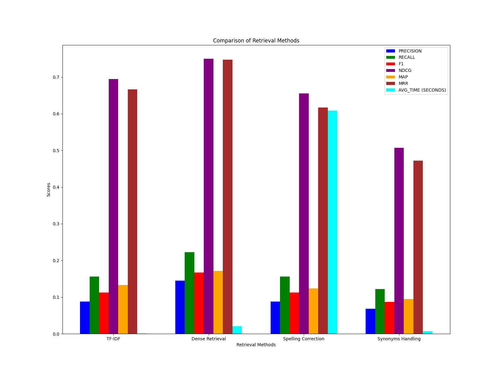

# IR Benchmarking Project


## Overview

This project aims to benchmark various Information Retrieval (IR) approaches on a given dataset. 
The goal is to evaluate and compare the performance of different IR techniques to identify 
the most effective methods for retrieving relevant information. 
Hence, execution time also becomes important in practical scenarios.

## Features

- **Multiple IR Approaches:** Implement and benchmark a variety of IR techniques (statistical like tf-idf, transformer based, etc.).
- **Dataset Evaluation:** Test the IR approaches on a specified dataset.
- **Performance Metrics:** Evaluate the performance using standard IR metrics like precision, recall, F1-score, and more.

## Installation

1. **Clone the Repository:**
    ```bash
    git clone https://github.com/nnn007/ir-benchmark.git
    cd ir-benchmark
    ```

2. **Install Dependencies:**
    ```bash
    pip install -r requirements.txt
    ```

3. **Download Dataset:**

   (Can change the dataset according to your usage)
    ```bash
    python download-dataset.py
    ```

## Usage

1. **Prepare the Dataset:**
    - Ensure your dataset is in the appropriate format and located in the specified directory.

2. **Run Benchmarks:**
    ```bash
    python performance.py
    ```

3. **View Results:**
    - The results will be output to the console and displayed in image.

## Contributing

We welcome contributions to improve the project! Please follow these steps:

1. **Fork the Repository**
2. **Create a New Branch**
    ```bash
    git checkout -b feature-branch
    ```
3. **Commit Your Changes**
    ```bash
    git commit -m "Add new feature"
    ```
4. **Push to the Branch**
    ```bash
    git push origin feature-branch
    ```
5. **Create a Pull Request**

## License

This project is licensed under the MIT License. See the [LICENSE](LICENSE) file for details.

## Contact

For any questions or suggestions, please open an issue or reach out to me at [nayan.nilesh@gmail.com](mailto:nayan.nilesh@gmail.com).
This project is in preliminary stage so lots of changes can be expected.